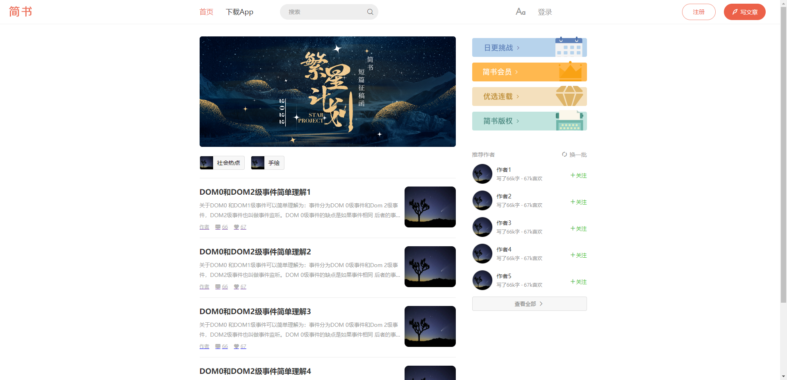
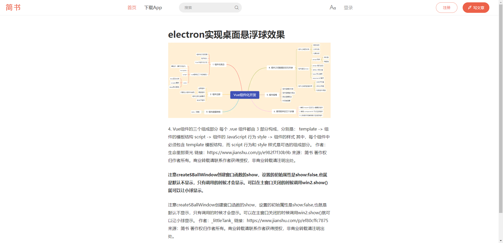
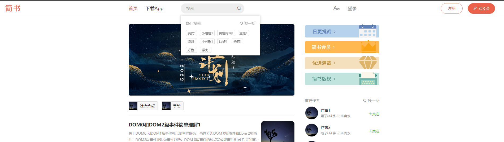

# react 简书

## 演示地址

### [点击预览](http://82.157.150.149:8081/)

## 一、技术栈

该项目主要使用 `react`搭配`redux`采用组件化的方式开发完成,此外项目中陆续使用有

- react-router-dom
- redux-thunk
- styled-components
- axios
- react-loadable
- immutable

## 二、运行效果截图

#### 1 首页

#### 2 详情页

#### 3 首页搜索

